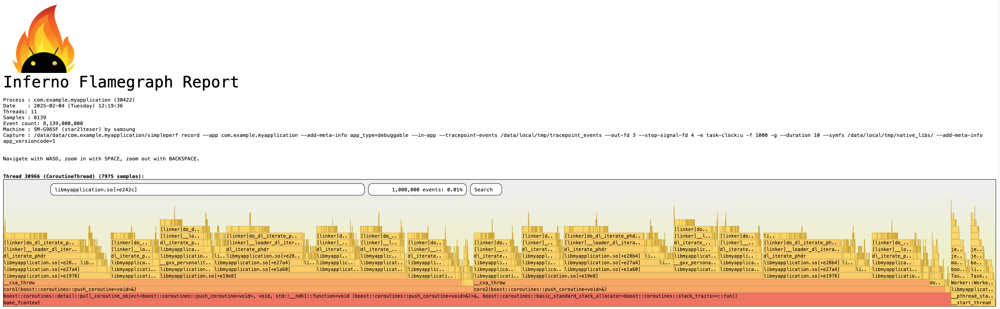
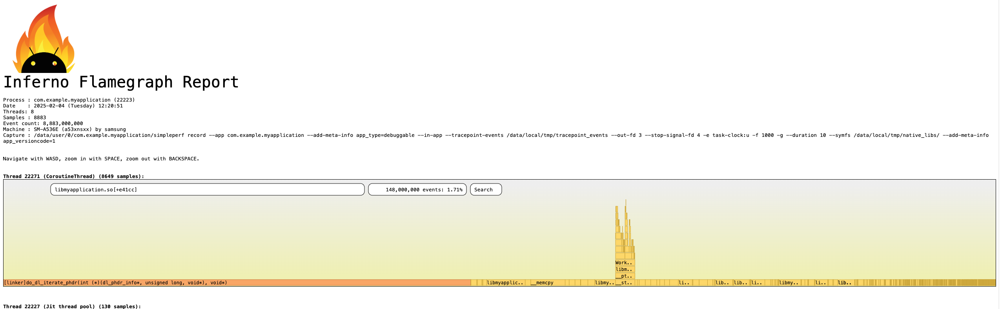

# Build
1. `git clone https://github.com/CBBBrother/MyApplication.git`
2. Open project in Android Studio
3. Build and run on device with Android 11+
4. Type in terminal `python {ndk_path}/simpleperf/app_profiler.py -p com.example.myapplication -lib {project_path}/app/build/intermediates/merged_native_libs/release/out/lib/arm64-v8a/ --ndk_path {ndk_path}`
5. In application press `Button`
6. Generate report with `{ndk_path}/simpleperf/inferno.sh -sc`

## Android 10

## Android 11+

